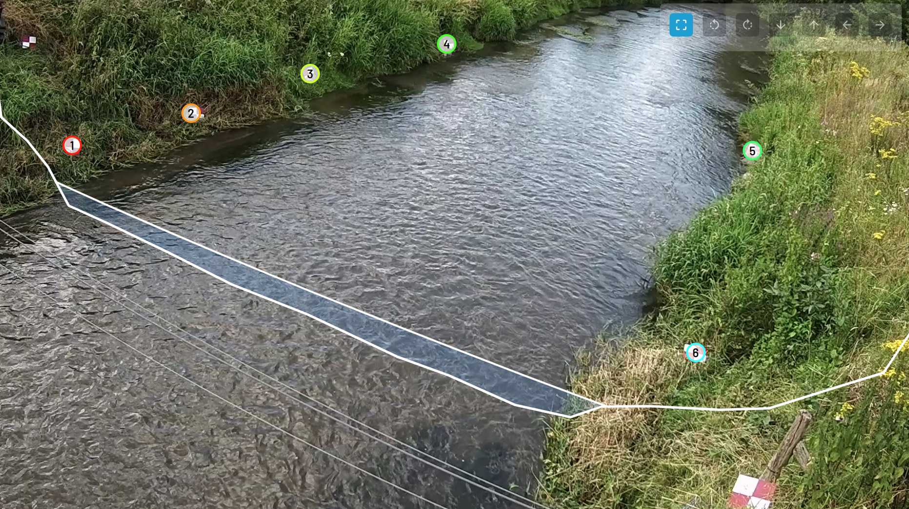
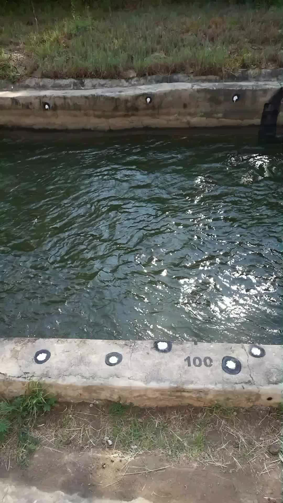

.. _field_survey:

Field survey measurements
-------------------------

Once a camera system is installed, several measurements are required in ORC-OS to enable processing of videos into
velocities and river flow. All of the observations needed are points in a 3D space, for which several methods
may be used. A schematic planar and sideview of the information obtained through the survey is provided in the image below.
We highly recommend to carefully read this section before doing any installation, and test out the entire survey
procedure before going into the field.

.. plot:: _scripts/plot_camera_datums_combined.py
   
    Information collected through surveying.

.. important::

   It is crucial that all datasets described below are measured in exactly the same coordinate system. In some cases
   this means that you should survey everything in one survey project as your coordinate system may change if you
   start a new survey. This is particularly the case if you use a Leica disto P2P set and if you use an RTK GPS set
   with a base station with a very short survey in period. This gives good relative accuracy but not absolute. Do not
   switch off your base station during the entire survey.

.. tip::

   If you do split the survey in smaller parts, make sure you measure at least two points again in the second survey,
   so that you can correct that x, y, z offset between the different survey parts afterwards. Always check your
   observations with some simple plots. This can be done for instance in Excel using scatter plots.

Requirement measurements
^^^^^^^^^^^^^^^^^^^^^^^^

The required measurements are given and described in the table below:

.. list-table::
      :header-rows: 1
      :widths: 25 35 35

      * - Data
        - Reason for required data
        - Tips
      * - Ground Control Points
        - Needed to make the camera understand how pixels translate into meter distances in different parts of the
          field of view. It is also crucial that the camera understands what a horizontal plane is so that it can
          project a water surface (roughly following a horizontal plane over short distances) to a real meter x meter
          image.
        - Ground control points MUST be spread in a "non-collinear" way over the objective of the camera. This means points
          should not be on a straight line. In other words, points should be spread over left and right bank and from
          upstream to downstream! If you have not performed a calibration of the camera's lens characteristics, then
          ORC-OS also uses Ground control points to constrain lens characteristics. But for this to work, the points
          should cover a significant part of the entire field of view. Check for instance the example below, where
          points were spread such that both the close and far bank have a good spread. Obviously the points close to
          the camera are much closer together in real world, but this is totally fine and a very good spread over the
          objective. Points should also not be almost at the edge of the image. Keep them a little bit away from the
          edges.
      * - Cross section profile (bottom coordinates)
        - Needed to estimate water depths with different occurring water levels, estimate the wetted cross sectional
          are and integrate velocity estimates (m/s) into river flow (m3/s).
        - Record these perpendicular to the overall flow direction in an as straight line as possible. You may have to
          wade with an instrument on a stick (e.g. RTK GPS antenna, total station or a board with marker or checkerboard
          if you use a disto). Record as much as you can, even beyond what the camera can see (see note below). Record
          more points when the bottom is very variable. If the bottom is entirely straight, only measure the points of
          inflection and measure those carefully.
      * - Water level
        - Needed to assess how the water level recorded with your survey equipment may relate to water levels recorded
          with an in-situ measurement device. Both will have a different vertical datum.
        - Measure this by holding your survey device on the line where water touches the land.
      * - Camera position
        - Can be used as a strong extra constraint on the camera calibration process.
        - Measure as close to the lens as possible.

Camera placement and aim
^^^^^^^^^^^^^^^^^^^^^^^^

Before any surveying you will have to decide where exactly to place your camera, how high and at what angle to aim it at
the stream. Often this is where things might go wrong. You might install infrastructure, like a mast, or other 
constructions only after which you find out it is at the wrong or at a less ideal situation for the given camera type
or for the stream. Here we try to give you a general sense what to be on the lookout for whilst making these decisions.

The figure below, with captions show some examples of wrong camera placements and aims from the top view. 
Take a good look at these, and the captions to know what you should do or avoid. The subplots are numbered a, b, c and d,
and we give some more details on each below the figure.

.. plot:: ./_scripts/plot_fieldwork_wrong_placement.py

   Examples of correct (top-left) and typical problematic placements and aims (other subplots) of the camera.

a. The camera is well positioned. It can nicely see the entire cross section from the left natural levee to the right.

b. The camera is tilted upwards too much. You are likely used to turn a camera such that it gives
   a pretty landscape view. This is not necessary and in fact not a good idea for two reasons. 

   - you here miss a part of the cross section, i.e. the last bit up to the natural levee close to the camera.
   - if your camera uses an auto-exposure, likely it will reduce the exposure to ensure the very bright sky
     does not get saturated. Reducing exposure will cause a too low illumination of the dark water below it.
     And this is what you are interested in. Too dark will cause that you cannot see the particles in the water, 
     and therefore the velocity estimation will reduce in accuracy.

   A simple rule of thumb: rotate downwards such that you still can just see the levee on the other side, but hardly 
   anything above it.

c. Here the opposite of **b** occurs: the camera is tilted down too much. Therefore, you will miss part
   of the natural levee on the far shore.

d. Your camera setup is very close or even in the floodplain. This may cause that you miss parts of the cross 
   section. Also a too low mast will cause that you will see little detail at the far shore. Consider getting
   the mast onto a higher place, ideally a little bit behind the natural levee.

No location is perfect! So in some if not many cases, you will have to use existing infrastructure to mount your
camera and you do not have a choice but to accept the position is not ideal. In these cases, consider the follow
options:

   - perhaps you can get a higher mast, that allows you to oversee a larger if not the entire section
   - accept that you miss a small part of the cross section. Consider which part will not convey much water and
     then aim and focus on the part you deem to be most important. Infilling techniques will ensure that missing
     parts in the cross section are still accounted for even though this is through extrapolation.
   - try to ensure that the angle between the water and your camera is everywhere at least 10 degrees. 
     If it is less in many parts of the water surface, then consider mounting on a higher mast.
   - it is usually also fine to rotate your camera a bit in the upstream or downstream direction. 
     Have a look for instance, at the picture below, showing footage from one of our most successful and
     sustainable installations so far in Limburg, The Netherlands. Because our infrastructure was already
     prepared and very close to the water, we were forced to install the camera and allow it to look
     a little bit downstream. We just made sure that the cross section fits in our objective and
     this gave us a very successful installation nonetheless.
 
Measurement locations are almost never perfect, so accept this, and use our tips to still get a good 
performing station.

   A successful installation in Limburg, The Netherlands, where the camera is looking a bit downstream but still
   captures the entire cross section.

GCP placement
^^^^^^^^^^^^^

The table with required measurements already explained that a good spread of GCPs is important. An example is provided below.

   A good spread of control points, painted on the sides of a channel

This example picture gives a typical situation of a good spread of control points along a channel. A few things can be 
noticed which are important to consider:

1. Points are spread over both left and right bank. This constrains the camera pose for close and far away pixels
2. Points are also spread from left to right in the objective. This means that points are in real-world close to
   each other close to the camera, but are more spread out further away. This is totally fine and actually ideal as it 
   constrains the camera pose for the entire field of view.
3. Although points are spread nicely, they are not precisely or very close to the edge of the Field of View. This is
   important because the edge of a typical lens of a camera may behave very erratically. So best is: spread the points,
   but not so far as that they are almost at the edge of the objective.

The figures below show examples of wrongly spread points. Take a good look at these, and the captions to know what you
should **NOT** do.

.. plot:: ./_scripts/plot_fieldwork_wrong_gcps.py

   Examples of correct (top-left) and typical problematic placements (other subplots) of GCPs.

a. Well-spread points, nicely within the objective, and spread over both banks. This is ideal and will lead to a 
   well-constrained camera pose and good results in the orthoprojection process.

b. The points are well spread from close to far, but do not spread from left-to-right. They are almost in a straight 
   line. There are therefore no constraints for left to right, and this will lead to a likely very poorly constrained 
   pose possibly with extruded or contracted views of reality from left to right.

c. The points are well spread from left to right, but all on one bank therefore making them collinear. There are no
   constraints for close to far, and this will lead to a likely very poorly constrained pose.

d. A nice spread of points, but some points are almost on the edge of the field of view. In the camera
   objective these would show up very close to the edge of the image. This will lead to overconstraints on the distortion
   parameters, possibly leading to bad results in the orthoprojection process.

In general: make sure you are happy with the combination of camera aim and placement before doing any surveying.
This will save you a lot of time and effort.

Survey guide
^^^^^^^^^^^^

Now that you have read about the required measurements, why these measurements are required, and what typically can go 
wrong, you are ready to start doing the measurements. Below, we have provided some notes on two typical survey 
approaches from top to bottom, using a Leica P2P set or a RTK GNSS device. Select the one that is most suitable for
your situation. If you use a spirit level and/or total station, the procedure is similar to the Leica disto P2P set
but you will have to do some extra calculations (especially with a staff gauge + spirit level). It is beyond scope
here to detail this. We assume that you already have some experience with these devices and can figure out how to use
them for the required measurements. 

.. tab-set::

    .. tab-item:: Leica Disto P2P set

        .. rubric:: What is a disto

        .. container:: figure-text-pair

           .. container:: column

                .. figure:: ../_images/_general/leica_disto_x6.jpg

                   Leica disto X6 P2P set

           .. container:: column

                A "disto" measures distances between a device carrying a strong laser and an object at a certain distance
                away from the device. It is used a lot in construction, for instance to measure distances between two walls.

                A P2P set connects points collected during a survey into a 3-dimensional coordinate system. Such a device
                uses a connected spirit level to understand what the horizontal plane is, gives the first point measured
                a coordinate X = 0, Y = 0, Z = 0 where Z is the vertical (up is positive) coordinate axis. For the second coordinate
                the disto will keep X = 0, and define the Y-coordinate as the horizontal distance between the first and second
                point and the Z-coordinate derived as the vertical distance based on the spirit level and angular difference
                the device is making from point one to two. The Leica disto systems add to this that each recorded point can
                be easily found using a small camera system and by taking a small photograph of the point for later reference.
                This makes the disto X6 one of the most robust and error-free measurement methods.

        .. container:: figure-text-pair wide-text

           .. container:: column

                Our experience is that with
                points surveyed with the Leica disto X6 P2P system (latest at the time of writing), an average reconstructed
                point accuracy of less than one centimeter can be reached. The cool thing is that you may use a lot of easy to
                find objects lying around during the survey, e.g. a rock, recognizable points on a wall perimeter, a bridge or
                other built objects, painted markers, and so on. It therefore may also be far less intrusive for the
                environment and may make it easier to do a survey in urban environments where you may not be allowed to place
                GCPs on certain places due to privacy reasons.

           .. container:: column

                .. figure:: ../_images/_general/leica_3d_capture.jpg
                    :width: 200px

                    3D capture functionality

        .. container:: figure-text-pair

           .. container:: column

                .. figure:: ../_images/_general/disto_point_example.jpg

                    Example of photo of control point by Leica disto X6 P2P set

           .. container:: column

                The disto approach also has a few disadvantages:
                
                * points should not be too far away, more than 100 meters is usually very difficult
                * the texture and color of the points matters. Very dark objects are usually extremely difficult to survey so
                  make sure the inside of the points you measure is light. Spray painted dark circles with white centres can work
                  well.

        .. warning::

           Make sure that the person carrying around survey points NEVER looks into the laser direectly. It can severely
           damage your eyes as it is very powerful.

        .. tip::

           Try out the device in a "dry" environment to test it and make sure you understand its features
           before taking it into the field. Try out to measure points closeby, far away and points of differing
           texture and colour to see under what conditions the points can be easily recorded.
           Also try to import a result into Excel or LibreOffice and see if you can work with the
           points, e.g. plot a top-view (X-Y scatter plot) and a side-view of the cross-section

        .. rubric:: Procedure

        - Fix the camera to a satisfactory position and angle so that it oversees the entire cross section you wish
          to use.
        - Spread or look for suitable objects as GCPs.
        - **IMPORTANT:** make a sample video with all GCPs in view. Make sure nothing or no-one is within line of
          sight. This video is essential, and used later in the calibration process.
        - Prepare a marker on a stick of sufficient length for the bottom cross section survey.
        - Measure and note down the length of the stick from bottom to the centre of the marker.
        - Look for a position from which you can see all points that you wish to survey. Usually you place the device
          somewhere near the camera in view of both banks. Set up the disto with
          spirit level and tripod such that it cannot move. This is extremely important. Consider putting some weight
          on the tripod legs to ensure the device is more stable.
        - Remove any blocking things such as rocks in the line of sight and overhanging leaves, grass or other
          vegetation.
        - When you start your survey, we recommend to take control over the axes. For instance first measure
          two random points that lie in upstream - downstream direction. This fixes the x-axis to upstream to
          downstream direction. These two points will not be used in further processing in ORC-OS so you should discard
          them before feeding them into ORC-OS.
        - Measure GCPs, cross-section (with the stick), water level (with the stick) camera position in one single
          survey.
        - Store the results immediately in a CSV file.
        - Make another control video in case you made any changes in the layout during the survey for whatever reason.
        - Whilst in the field and before wrapping up, do some postprocessing on the CSV file where needed (see below)
          and feed in the control video, GCPs and cross section (split the CSV in parts for GCP and cross section)
          and check if the fit of the control points and the layout of the cross-section looks accurate.
        - Considering doing the survey again if anything seems wrong. Otherwise, clear out all control points and make
          sure no rubbish is left behind.

        .. rubric:: Guidance in use

        By using a disto P2P device, you will get very high accuracy measurements if you follow the following
        guidelines:

        - Make sure you survey **everything in one single survey**. Bear in mind the devices tend to turn off themselves
          after a few minutes idling. You can extend the amount of minutes in the settings which is highly recommended.
        - Make sure there are no leaves, overhanging branches, etcetera blocking the laser.
        - With every point collected, check if the device really recorded it. It may give an error code if the point is
          not good. This can be due to movements of the device or point during the recording.
        - In hot environments, upward moving eddies, especially above hot surfaces can attenuate the laser beam as it
          travels through air. Considering doing the survey at cooler moments, when there is sufficient light. This can
          be early morning or during a moment that the area to survey is in the shade.
        - If a persistent error code appears, note it down and look it up in online documentation. It can give a clear
          idea what the problem is and lead to resolving it.
        - After the survey, you may need to do some postprocessing to get all points in the same system. For instance,
          if you use a marker on a stick to survey the cross section, then you should remove the length between the
          bottom of the stick and the centre of the marker to get the bottom coordinates. The exported file is CSV
          format and can be read into Excel directly. Also, if you surveyed two points to fix the axes, then those two
          points should be removed from the result CSV file.
        - Split your data into two files: one only containing the GCPs and one only containing the cross section.

    .. tab-item:: RTK GNSS

        .. rubric:: What is RTK GNSS

        .. container:: figure-text-pair

           .. container:: column

                .. figure:: ../_images/_general/RTKGNSS.jpg

                   Ardusimple rover station, used to measure a cross section and red/white GCPs. The markers are
                   slightly tilted towards the camera so that they can be easily identified in the video image later on.

           .. container:: column

            Real-Time Kinematics Global Navigation Satellite Systems (RTK-GNSS) measure geographical coordinates at an
            extremely high accuracy and in real-time (i.e. only a very short survey period is needed per point). This is
            done by using a fixed nearby GNSS station that continuously records and sends out survey data of its own
            position. The mobile station (a.k.a. "rover") uses the real-time collected data at the base station and at its
            own position to make an accurate estimation of its own position, essentially by comparing the resolved location
            of the base station with its known position. Through data assimilation in time, the solution becomes more
            accurate when more satellite data has been received.

        .. tip::

            RTK-GNSS base-rover sets used to be a very expensive piece of equipment. Since a few years, company uBlox
            started producing low cost GNSS chipsets that have the ability to perform RTK computations on the chip
            using a large amount of satellite constellations and several wavelengths. Company Ardusimple sells ready to
            use base-rover kits based on these chipsets. These are very affordable. Including a measurement pole with
            spirit level you can expect to spend about 1000 euros for a complete set. It is ideal in sites where quite
            large distances are involved (50 - 100 meter or even wider river sections) as there disto measurements may
            become infeasible.

        .. rubric:: Procedure

        - First setup your base station following the user manual of the equipment. Let it measure long enough so that
          it has a stable point. Absolute accuracy is not needed, so usually a survey of 15-30 minutes is sufficient.
          Once survey is completed, the base station will send out correction messages. DO NOT switch off the base
          station during the survey if you use Survey-In mode for a short period.
        - Fix the camera to a satisfactory position and angle so that it oversees the entire cross section you wish
          to use.
        - Spread or look for suitable objects to serve as GCPs. Make sure any object is clearly marked and slightly
          tilted towards the camera, such that you can
          find it back in the image. Only white, or only dark usually is not sufficient. Use a combination of white and
          dark.
        - **IMPORTANT:** make a sample video with all GCPs in view. Make sure nothing or no-one is within line of
          sight. This video is essential, and used later in the calibration process.
        - Prepare your rover, putting the antenna on a pole with a spirit level. The pole should be high enough so that
          it can be used for the bottom cross section survey.
        - Measure and note down the length of the stick from bottom to the centre of the marker if needed.
        - Measure GCPs, cross-section, water level, and camera position. Again make sure that during this survey
          the base station is never switched on/off.
        - Store the results immediately in a CSV or Shapefile or other geographical format.
        - Make another control video in case you made any changes in the layout during the survey for whatever reason.
        - Whilst in the field and before wrapping up, do some postprocessing on the CSV file where needed (see below)
          and feed in the control video, GCPs and cross section (split the CSV in parts for GCP and cross section)
          and check if the fit of the control points and the layout of the cross-section looks accurate.
        - Considering doing the survey again if anything seems wrong. Otherwise, clear out all control points, pack up
          the base and rover stations and make sure no rubbish is left behind.

        .. rubric:: Guidance in use

        RTK-GNSS use is more complex and error prone than a Leica disto P2P device. Therefore read the guidelines
        below and make sure you practice the entire procedure in a controlled environment before going into the
        field:

        - First consider if RTK-GNSS will work in the chosen environment. RTK-GNSS does not work well in areas with
          very high buildings or just next to a wall. Make sure that you can position GCPs in some clear part of
          the area.
        - When placing GCPs, make sure you can easily reach the point with the survey pole, while still being able
          to read the spirit level and whether a "FIX" status is reached or not. A steep slope is usually not ideal.
        - Before taking a point (especially a GCP), the survey pole **must be kept perfectly vertical!** A small
          deviation from vertical can easily result in errors of 10cm (several inches) or more. **A spirit level on
          the pole is a MUST!**
        - Only record a point when the status is "FIX". If the status is "FLOAT" or (even worse) "DGPS" or "SINGLE"
          the accuracy of the measurement will be too low to give a good result. Most surveying software like SW
          Maps have settings that accept points only when they have a certain minimum status. Set this setting to
          "FIX"!
        - With every point collected, check if the device really recorded it. If "FIX" is not reached, the point
          should not have been recorded. Sometimes, keeping the pole stable for a few seconds helps to obtain
          status "FIX".
        - After the survey, you may need to do some postprocessing to get all points in the same system.
          The exported file may be a geographical file such as Shapefile or GeoJSON. Ensure the file is first
          converted into a GeoJSON with a local projection with unit metre (not degrees!). You can do this with
          the free and open-source and excellent `QGIS <https://qgis.org>`_ software.
        - After converting, split your data into two files: one only containing the GCPs and one only containing
          the cross section. Also this can be done in `QGIS <https://qgis.org>`_.
