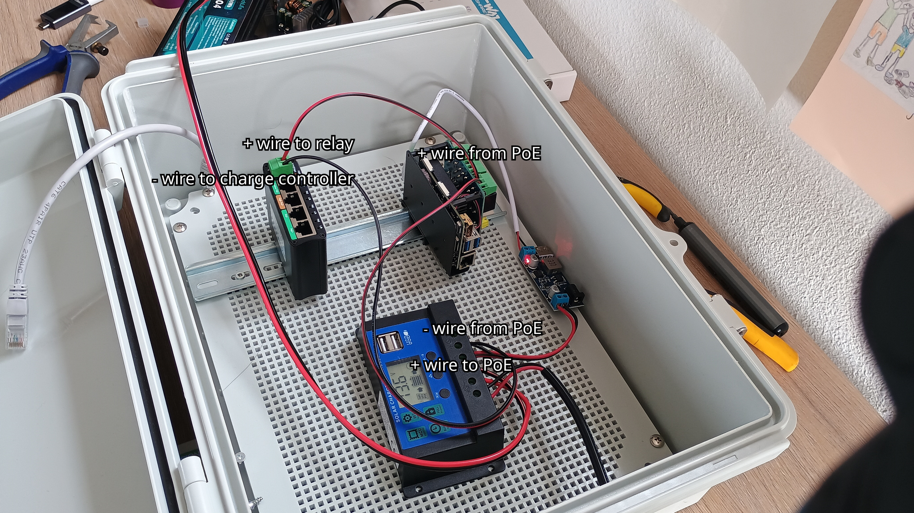

Assemblage
----------

Below, we provide a detailed guide to assemblage. We do this step-by-step.
After each intermediary step, you should test if the setup works as expected
before moving on.

Step 1: Getting the Raspberry Pi running
^^^^^^^^^^^^^^^^^^^^^^^^^^^^^^^^^^^^^^^^

1. Assuming you have a Pi 5 Compute Module with a carrier board, put the Raspberry Pi 5 CM on the carrier board, and 
   install the active cooler. 
2. Install ORC-OS as indicated on the 
   `README <https://github.com/localdevices/ORC-OS/blob/main/README.md>`_ of ORC-OS.
   This can be on a SD-card or directly on the eMMC memory of a Pi5 Compute
   Module.
   
.. tip::   

   We recommend getting our ready-to-flash |images| as this will give you a huge 
   head start with everything pre-installed including services for power 
   management, relay management and remote connectivity.

3. Fix the modem HAT on the Pi (or connect with a USB-C cable) and insert a 
   SIM-card. Make sure the SIM card does not have a PIN-code. This will save
   you a lot of trouble. Use stacking header to get enough space between the HATs.  
4. Fix the Relay HAT on top of the modem HAT (or vice versa, whatever is easiest 
   for you). If you use a separate relay board, just ensure you follow the 
   instructions on how to hook it up to the Raspberry Pi.
5. Switch on the Pi with a normal 5V/5A power supply and connect a laptop or 
   computer via a LAN cable. Do not connect the battery and solar panel yet, 
   as we will do this later on.
6. Log into the web interface of ORC-OS by going to http://orcos.local. If this
   is successful, you should see the dashboard and be able to navigate through 
   the menu. Your first step is successful!
7. As each modem is slightly different,
   you may have to do some online research on how to properly get the SIM-card working
   in your specific modem.

Step 2: Getting the relay module running
^^^^^^^^^^^^^^^^^^^^^^^^^^^^^^^^^^^^^^^^

7. Program one of the relays on the HAT to switch on for 30 seconds during boot. 
   This can be done by creating an additional :ref:`service <devel_services>`. 
   We provide relay switching as a full example in the manual. 

.. tip::

    With Rainbow Sensing's ready-to-flash |images|, the relay service is entirely
    preprogrammed. Just skip step 7 entirely!

8. Once the relay service is available, select the relay pin
   (tip: first relay of a relay HAT is on 26), select a frequency of e.g. 300 
   seconds, and a duration of 30 seconds. Test it by clicking on "Start".
   You should hear the relay switch on with a click sound, and then switch off after 30 seconds. 

Congratulations: you have a relay working on your Raspberry Pi 5. This relay 
can be used to switch on the PoE adapter for the camera, but for now we will 
keep it off and directly connect the camera to the PoE adapter for testing. The 
modem is also already installed, let's not worry about that now.

Step 3: Hooking up the power supply
^^^^^^^^^^^^^^^^^^^^^^^^^^^^^^^^^^^

.. warning::

    When working with electricity, always be careful and take the necessary safety measures. If you are not sure, 
    please consult an expert or do more research before proceeding. In general, 12V is not necessarily very 
    dangerous but you should never short cut the + and - terminal of the battery as this may cause sparks, very high
    current in your wires, and even fire. Always use a fuse (attached as close as possible to the "+" terminal)
    for safety, and ensure you have the proper tools and equipment to work with electricity safely. A multimeter is
    highly recommended to check voltages everywhere in the system before connecting anything.

1. Prepare some wires to connect the battery to the charge controller. Typically you need a terminal connector, some 
   cable connectors, a crimp tool, a wire stripper, isolation tape and some 12V capable double wire, preferrably colour 
   coded (red for + and black for -) of about 0.75 to 1 mm2, and some ferrules for the connecting ends.
   Check online for videos on how to prepare proper cables. For instance the video below.

    .. youtube:: KE3CjZ0BUFo

   Do not mix up the colors. If you confuse them and connect 
   "+" to "-" you may damage equipment. Wire as follows: Take the fuse holder, cut it about half way, strip it on both 
   ends, connect a terminal connector on one end and a cable connector on the other end. Take a piece of electric wire,
   split it over a small part so that you can connect the fuse holder on the red part, and another terminal connector
   on the black ("-") part. Strip the other ends, apply ferrules, and connect the "-" to the charge controller's "-" of the battery
   terminal, and the "+" to the "+" terminal of the charge controller. Now also connect the terminal connectors
   to the battery, again ensuring the correct polarity. The fuse should be directly behind the "+" terminal of the 
   battery. The black part of the wire should go on the "-". Now the battery and charge controller are securely 
   connected. Assuming the battery has some power, check the voltage on the charge controller with a multimeter.
   Below, a photo of the wiring of the battery to the charge controller with a fuse and connectors is shown.

   <PHOTO of wiring with fuse and connectors inside box>

2. If you want and there is enough sun, you can now also connect the solar panel to the charge controller. Before you
   do this, block all sunlight from the panel first. To connect, follow the same steps as for the battery. But now you
   connect the wires to the "solar panel" terminal of the charge controller. After connecting, you can unblock the solar 
   panel and check the voltage on the charge controller with a multimeter.
   Of course you only get a voltage if the panel is in the sun. A typical panel rated for 12V in the 
   sun can easily deliver 13 or 14 volts or much lower when in the shade. This is normal, as the voltage depends on the 
   amount of sunlight and the 
   charge controller regulates the voltage to the battery. If you do not have a solar panel or it is not sunny, you 
   can also connect a 12V power supply to the charge controller. Just strip the end on the power supply side, plug it 
   into the wall and connect the wires to the "solar panel" terminal of the charge controller. Again, ensure correct
   polarity and check with a multimeter if you get power on the charge controller.

.. container:: figure-text-pair

   .. container:: column

      .. figure:: ../_images/_hardware/solar_voltage_shade.jpg
         :width: 100%

         Voltage reading when solar panel is kept in the shade.

   .. container:: column

      .. figure:: ../_images/_hardware/solar_voltage.jpg
         :width: 100%

         Voltage reading when solar panel is in direct sunlight.

3. Charge your 12V battery to a satisfactory amount for testing. You can do this safely by connecting the battery to 
   the charge controller and connecting the charge controller to the solar panel, or by using a separate 12V charger. 
   Connect the battery to the charge controller and test with a multimeter if you can get power from the load terminal 
   (12V) of the charge controller. This is where you will connect the PoE adapter and 12V --> 5V buck converter later 
   on.

.. warning:: 
   
   Before connecting anything to the load terminal, make sure you switch off the load with the power button on the 
   charge controller. This button is usually indicated with a "lightning" or a "lightbulb" symbol. If you do not switch
   off the load, you may easily cause a short circuit when connecting as wires may still be exposed.

4. Now it is time to connect your Raspberry Pi setup. Raspberry Pi cannot work with 12V. In fact the Pi will blow up if
   you would supply that. First connect the buck converter to the charge controller load terminal (12V) with a simple 
   piece of +/- (red/black) wire. Again, ensure correct polarity! The buck converter will convert the 12V to a stable 
   5V 5A output that is suitable for the Raspberry Pi. Once connected, there should be a red light on the buck 
   converter indicating it is powered. Check the voltage on the other side first and see if it is about 5V. If the wires
   are a little openly exposed, then use isolation tape to cover the exposed parts to prevent short circuits. Do this
   on both sides. Many buck converters have a small screw to setup the output voltage. If you have such a buck converter, 
   make sure to adjust this to 5V before connecting the Raspberry Pi.

.. container:: figure-text-pair

   .. container:: column

      .. figure:: ../_images/_hardware/buck_converter_voltage_in.jpg
         :width: 100%

         Voltage reading on the input of the buck converter, which should be about 12V. It can be higher when the 
         battery is fully charged.

   .. container:: column

      .. figure:: ../_images/_hardware/buck_converter_voltage_out.jpg
         :width: 100%

         Voltage reading on the output of the buck converter, which should be about 5V. It can be a little bit higher,
         but not substantially as this may damage the Raspberry Pi. If you have a variable buck converter, you can 
         adjust the output voltage with the potentiometer on the converter. Always really make sure the voltage is 
         correct before connecting the Raspberry Pi.

5. Now connect the output of the buck converter to the Raspberry Pi via the USB-C open end cable. Test if you can power
   on the Raspberry Pi with this setup. The green light should go on and your programmed relay should switch on with
   a click sound.

Excellent. You are now powering your Raspberry Pi with the battery. 
The next step is to connect the camera and test if you can receive videos.

Step 4: Connecting peripherals
^^^^^^^^^^^^^^^^^^^^^^^^^^^^^^

The relay is working fine, but it is not really powering anything yet. Let's connect the PoE adapter to the relay, 
so that it can switch on and off the camera. The PoE adapter we selected (Linovision) 
requires 12V so we can quite easily connect it to the 
charge controller load terminal (12V) with a simple piece of +/- (red/black) wire. 
No buck converter is needed. Again, ensure correct polarity!
The relay will be in between the PoE adapter and the charge controller, so that it can switch on/off the power to the 
PoE adapter. As we need two devices to be powered from the 12V output, we recommend to use a splitter to split 
the 12V output from the charge controller into several outputs. Take out the original wire from the charge controller
and put the splitter in between. Again, ensure correct polarity! Connect the splitter 
to the charge controller load terminal to power both devices, and then connect the buck converter and the PoE.

.. warning:: Before disconnecting, make sure you switch off the load with the power button on the charge controller.
  
1. Connect the PoE adapter to the splitter as well with a properly prepared piece of +/- (red/black) wire. The connect the splitter 
   to the load terminal of the charge controller. We now have both devices powered in parallel.For now we do not use the relay, as we want
   to first test if the PoE adapter works and can power the camera. The PoE adapter
   uses 12V as input, so no buck converter is needed for the PoE adapter in our case.

.. warning:: 

   You may have acquired a different PoE adapter than the one we indicated in the parts list. Make sure that you get
   one that can handle 12V or ensure that the voltage is converted with a buck step-up or step-down converter to the
   right voltage first. If the PoE adapter has a 220 to 12V adapter you can cut off the and strip the +/- wires on the
   12V side and connect these to the splitter. Always check the PoE manual and check carefully 
   the required voltages before connecting any equipment.

2. Connect the IP camera to the PoE adapter with the long CAT6 network cable. If you have a separate 
   switch, you can also connect the camera to the PoE adapter, and the PoE adapter to the switch (not the other way
   around).

3. Connect the Raspberry Pi with a LAN cable to the PoE Switch, so that it shares the same network as the IP 
   camera. Connect your own computer to the switch as well (NOT on a passive PoE port!!). Test if you can access the
   Raspberry Pi through the network for instance by logging into the ORC-OS interface. That usually is possible on 
   ``http://orcos`` or ``http://orcos.local`` or replace ``orcos`` for the hostname you created while installing.

4. Test if the camera's web interface is accessible. The camera usually has its own web interface that you can connect to
   via a hostname or IP address. Check the manual of your camera to find out how to access it. If you can access the 
   web interface, you can also test if you can see the live stream from the camera. If this works, then the camera is
   properly powered and connected to the network.

5. Once verified, you can wire in the relays! Again, switch off the load on the charge controller first! Then remove 
   the + wire from the PoE adapter, and connect it to the normally open (NO) terminal of the relay. This is because
   without any signal, you want this relay to be open so that it does not supply power. Then connect a new red wire from
   the common (COM) terminal (middle of the relay) to the PoE adapter. Check below to see what the wiring should look
   like.

   Wiring of the relay in between the charge controller and the PoE adapter. The relay is used to switch on/off the
   power to the PoE adapter, which in turn powers the camera. The relay is controlled by the Raspberry Pi, which can
   be programmed to switch on/off the relay at certain intervals or at boot.

Your camera is now connected and powered through the relay. The next step is to 
set up the camera and ORC-OS for receiving videos.

Step 5: Setting up the camera and ORC-OS for receiving videos
^^^^^^^^^^^^^^^^^^^^^^^^^^^^^^^^^^^^^^^^^^^^^^^^^^^^^^^^^^^^^

1. Go to the Settings - Daemon settings. Fill out the expected file name convention for receiving videos from your
   IP-camera (check the manual of the IP camera, you expect something like ``video_20260103_141500.mp4`` for a video
   taken on 3 January 2026, 2:15 PM. This would yield a naming convention ``video_{%Y%m%d_%H%M%S}.mp4``. Click on 
   "Submit".
2. Now click on <EXAMPLES> to see how to get such video files transferred from the IP camera to the raspberry pi.
   You want to note the SFTP details and the specific folder the files should go to.
3. Now login to the IP camera web interface (check the IP camera's manual, this is different for all camera models).
4. Program an "event" that records a 5-sec video when the camera switches on. Use SFTP to transfer the video file
   directly to the Raspberry Pi using the details taken from ORC-OS. If a single event at boot is not possible, you
   can also program the camera to record 5-seconds at set intervals, such as every 30 minutes. In practice it will
   then only record at boot, as your cycle is shorter than 30 minutes. Ensure the bit rate is high! Ideally 20Mbps
   (Megabit per second). This is to ensure that the details visible on the water surface are not lost through 
   compression.
5. Test the event and check if the files indeed end up in the right folder. You can do this in a normal terminal or
   file explorer. Currently these are not yet processed.

All your connections and software setup is now ready.

Step 6: Install for field use
^^^^^^^^^^^^^^^^^^^^^^^^^^^^

1. Install all components in the IP66 enclosure. Prepare the wiring of the solar panels with a long enough wire. 
   Pass the cables and fix these watertight with passthrough gland cable connectors.
2. If possible, keep the battery inside the housing with short wires, and keep it a little away from the electronics. 
   Clamp it with wall irons or something else that keeps it from the bottom of the casing. The battery may become warm 
   during operations.
3. Install the device, with the camera aimed at the water surface. Carefully read our 
   :ref:`Survey guide <field_survey>` to properly position and aim the device. 
4. During setup, pass the long network cable through the enclosure with passthrough gland cable connectors, and reconnect 
   everything afterwards. Try to keep as much of the wiring inside of the box, wind it up neatly and fix it with cable 
   ties. If cable is outside, always tie it up neatly at a high position. Under no circumstance should you leave it on 
   the ground as it is then more exposed to water, wildlife, bugs, hot surface temperatures, trampling and other risks.
5. Start configuring ORC-OS! See our extensive :ref:`User guide <user-guide>`. Don't forget to set up remote management
   if you want to be able to access the device remotely. If you have an image or support contract with Rainbow Sensing, 
   you will receive remote connectivity for your devices within the support package, which you
   can later always transfer to your own independent remote connectivity solution.
6. Also setup the connection with your own :ref:`LiveORC server <liveorc>` to 
   synchronize and centralize all your processed data and videos.
7. Once configured, enable all required services in the service options, such as power management and relay management.
   Choose parameters such as durations and boot cycles according to your needs.
8. Wait for a few cycles to see if everything works as expected.
9. Go home and let the device collect your data! Just make sure you have a sufficiently large data package on your SIM 
   card.

.. note::

   If you decide to get |support| from Rainbow Sensing, you will receive remote connectivity for
   your devices within the support package if your device is compatible. Remote support works through a pangolin server
   and accounts and offers you a very secure https access to services via a proxy server, with highly granular access. This is very
   similar to services such as remoteit and cloudflare, but own-hosted. You are free to setup your own Pangolin server 
   or other remote connectivity solution if you do not want to use the one provided by Rainbow Sensing and/or become 
   more independent.

.. |images| raw:: html    

    <a href="https://openrivercam.org/products" target="_blank" rel="noopener noreferrer">images</a>

.. |support| raw:: html    

    <a href="https://openrivercam.org/products" target="_blank" rel="noopener noreferrer">images or a support contract</a>
