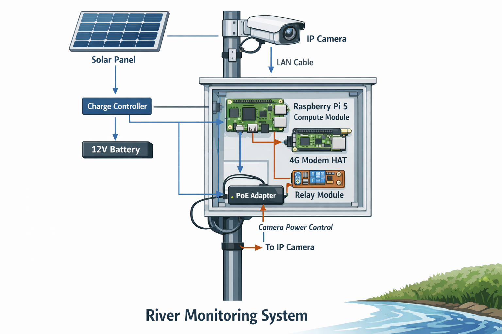

.. _typical_setup:

A typical set of parts
----------------------

Once the software is installed, you will need a proper setup in the field. We 
provide guidance here how to establish a complete field setup.

   Impression of a typical hardware setup and the required connections
   :scale: 50 %
   :alt: hardware setup

We here turn to more practical guidance.
To help you build your own camera setup we here give an overview of possible 
parts that we have ourselves tested with. You will see that these parts
broadly cover what we have described in the previous section. 
The figure above gives an impression what the entire build would look like. Some
details are left out for simplicity, but the general idea should be clear: 
your small electronic components and most of the wiring is inside an enclosure.
The camera and the power supply are outside. If your battery is small enough 
you can place it in the same enclosure.

We assume a setup with solar power and running 
every 30 minutes. We are not frequently and actively maintaining the parts list.
Please let us know if anything seems out of order by creating a Github issue on
the `ORC-OS-docs GitHub repository <https://github.com/localdevices/ORC-OS-docs>`_.

.. warning::

   We do NOT give any guarantee that with these parts, your build will work. We also do not give
   any support without a agreed project. It may be that certain parts change in time. We are never responsible for
   any issue related to your own build nor for any incompatibilities with the ORC-OS software.

.. list-table::
    :header-rows: 1
    :widths: 35 65

    * - Part
      - Example specific item
    * - Raspberry Pi 5 CM (8/32GB)
      - `Raspberry Pi 5 <https://www.raspberrypi.com/products/raspberry-pi-5/>`_
    * - Compute Module board (8/32GB, note that there are also industrial grade options,
        that can handle a larger temperature range, but these are more expensive and may be 
        more difficult to get).
      - `Waveshare CM5-IO-Base-B <https://www.waveshare.com/cm5-io-base-b.htm?sku=30703>`_
    * - Active cooler for Raspberry Pi 5
      - `Waveshare active cooler for CM5 <https://www.waveshare.com/cm5-fan-3007-5v.htm?srsltid=AfmBOopLk_ws8IzYfTvdiKfIjJIpYJ7of6YJRmunQx7_f5n9zkALIaFL>`_
    * - Rechargeable battery for Real-Time clock and power management. For larger
        carrier boards, a CM/ML2032 is needed. For smaller boards, (e.g. the
        Waveshare CM5 IO Base-B) typically a CR/ML1220 is needed.
        The normal Raspberry Pi 5 model with SD card has a special prepared battery.
      - Please check availability locally. 3.7V LIR rechargeable batteries typically work.
        The battery does not have to be rechargeable, but it is more convenient as you do 
        not have to replace it when it runs out.
    * - Weather proof IP camera (ideally >= 20Mbps, 1080p, capable to record on event-basis, e.g. during startup, or 
        at time-intervals). 
      - `AXIS P1135-E Mk II <https://www.axis.com/products/axis-m1135-e-mk-ii>`_
    * - 4G modem (can also be a Raspberry Pi modem HAT like a Waveshare7600E-H)
      - `Waveshare7600G-H industrial modem <https://www.amazon.com/Industrial-SIM7600G-H-4G-DTU-Communication/dp/B09R4KT3YR/ref=sr_1_3?crid=2OY18KJIUO6GI&dib=eyJ2IjoiMSJ9.g_UQWhh0M8xCpU_VY4zkv_T8UAGLn_itDNlcnXPPbgKn1wepvusOoJ9ymFRSRqI1EN1UiNLd8XPPZ1LXS2ZQGxWOTQ_HYdxXTmtkT4iEyld8gGRcE-gr7gbhryLNpZSoirfdWuU3fFsDuyY-ZM1HMh1c-SrPBLM-eIUowGt3L-Q_m6lKL0jbp6mAdmc6rldNlm_mKnULhkpMYDPto_jFPKHEvZiBLhXLPfWZgKIXSjo.DCbhAH0y5nIyISu5cJDb52RSWEg7AsSxLSabXOoOn6g&dib_tag=se&keywords=industrial+7600G-H+waveshare&qid=1779787837&sprefix=industrial+7600g-h+waveshar%2Caps%2C194&sr=8-3>`_
        You may also get a 7600G-H chipset on a HAT or other device. HATs may be more sensitive to
        cable damage as the cables are quite small. They all work in a similar way.
    * - Relay module (can be a Pi HAT or a separate layout, if you need more peripherals, relay boards of 8 relays with Raspberry Pi 
        header are available also).
      - `RPi Relay Board <https://www.waveshare.com/wiki/RPi_Relay_Board>`_
    * - PoE adapter (12V; verify power specs). The one indicated below is very nice, as it can directly be connected 
        to the solar charge load output (12V) with a simple +/- wire, and provides all the switch options
        you will need. Just be careful NOT to use the "passive PoE LAN port" (only one) on a device that is not designed 
        for it, as this can damage your LAN port.
      - `LINOVISION PoE switch for DC powered systems <https://eu.linovision.com/en-eu/collections/all-poe-switches/products/4-ports-mini-solar-poe-switch-optimized-for-big-ptz-camera-and-wireless-bridges?_pos=2&_fid=d8b5ba801&_ss=c>`_
    * - 12V to 5V (USB) buck converter, 5A for Raspberry Pi 5. The device indicated here is very easy to use as you 
        do not need to tweak the voltage or current. Just connect the 12V input and you get a stable 5V 5A output. We 
        recommend to put a spare one inside the housing in case it fails.
      - Sold on amazon.com e.g. `DEVMO 12V to 5V 5A Step-Down <https://www.amazon.com/DEVMO-Converter-Step-Down-Regulator-Transformer/dp/B09C4HPNJ8/ref=sr_1_11?dib=eyJ2IjoiMSJ9.RZsxLbFRLcU8Wb5O2N-5KjMcJ6uj1CoIoVbBQr4STi2nn6d88k_vvBEjd3TDfF1TUFG0_04Tchp9esoT8_nmfegVbZhdkErK-zT_2o9ZQX2eBJNbN-X9-kjJVchUWCA9eBo5tQZFStZovLdhs98BJyhv93V8ZhQyyslG4ILrTzFhK3OBGKHWr7ZUgFr1rJ9RxPkQkle4oxa4mNnuEAJevyGPTYtAqVepEHDPPPv1w8EHE_aqNBE0M0UVf_kjmDnycLmHf4u1SRdzXKlINuMrt2qboR1R5bS0C6TAlCN3q9o.zKXYl-61B5JUPgaXJbKZUSRhCvGflPU_vFfEAFQ1HIA&dib_tag=se&qid=1768307208&refinements=p_89%3ADEVMO&s=electronics&sr=1-11>`_
    * - CAT6 outdoor network cable of sufficient length to go from the PoE adapter to the camera
      - Any computer hardware shop.
    * - USB-C "open end" cable that can handle 5A current. This is for connecting the buck converter to the Raspberry 
        Pi.
      - E.g. `this link <https://www.amazon.com/11inch-Pigtail-Equipment-Installed-Replacement/dp/B0DLKPWF1G/ref=sr_1_3?crid=1I2ANFUJZR61V&dib=eyJ2IjoiMSJ9.a4Ft-il2Dw8I7G-8lhyY7R-qoSNnJknf-mRPHak9BNrjZlcDMcM3oFtowb88AnhET1Sk4KceVfl1CFUFcHY4tAap2TuQDV7k9iDgYGSEO4VNES4wLqB-mPPJO-iHHAGEplTqud5WWDplv5CiQD849ItUpD-Tp33KlKYP-3Tb1NlgnrbaDJgnL7bhd6tNIDBxDtQC7c7hW3bJEQonujhv78WHmYafl_kShSBQHi0SGMM.rrJXGCxylumBzGiEWZ2Jw5cnIt3PMwM-9ez7y7sH1SA&dib_tag=se&keywords=USB-C%2Bbare%2Bwire%2B20%2BAVG%2B5A&qid=1775045092&sprefix=usb-c%2Bbare%2Bwire%2B20%2Bavg%2B5a%2Caps%2C178&sr=8-3&th=1>`_
    * - A very short (e.g. 0.5 meter) CAT6 network cable. This is for connecting the Raspberry Pi to the switch.
      - Any computer hardware shop.
    * - Solar panel (>= 50W)
      - Any electronics/solar shop.
    * - MQTT Solar charge controller
      - Any electronics/solar shop.
    * - 12V battery (>= 96Wh)
      - Any electronics/solar shop. Consider a compact LiFePO4 battery for better environmental performance. Note that the battery size
        required will be strongly dependent on the frequency of observations, the total power requirements of your setup,
        and the amount of sunlight in your location. We recommend to calculate your power requirements carefully. If your battery empties,
        the solar charge controller will stop providing power to the setup, until the battery is sufficiently charged again. After that the
        setup will automatically start again. So even with a smaller battery, you can still get a working setup, but it may be less stable 
        and you may have more "downtime" of your camera.
    * - +/- terminal connectors compatible with the 12V battery.
      - Any electronics shop.
    * - A fuse (e.g. 5A or 7A) for safety, to be placed directly behind the "+" terminal of the battery. We like fuse holders
        with a blade fuse, as it makes things so simple to replace but there are many options for this. Also here,
        recommended to put a few spare fuses inside the housing in case of failure.
      - Any electronics shop.  
    * - a IP66 (minimum) enclosure. Look for one that has optional cable outlets so that you can bring +/- of solar panel into
        the device and a network cable out. At least two cables will need to pass through. If you need more holes, carefully
        prepare these with a step drill.
        Ideally get one or two DIN rail pieces in the box for proper and neat device and cable management.
      - Sold on amazon.com, but look carefully for one, large enough, and with the proper cable options.
    * - watertight cable enclosures
      - Sold on amazon.com e.g. `3.5-10mm waterproof IP68 electrical cable connectors <https://www.amazon.com/Junction-Waterproof-Electrical-Connector-3-5-10mm/dp/B083HRLQG3/ref=sr_1_8?crid=HEXI3WRNBK05&dib=eyJ2IjoiMSJ9.1OgXdhDDhFyRtnLGA9HrHG7yCSQf3A_MBkggyG9Ps9lv6DH14X6Rou6pRoXwdBd1S_5NyPLheFDoA9PCpXOyiUILaiG--e_MmnNDt_nRV508q1TGmHOfWa69i_woKkwZbBnw8zu5mEHXyfcVZDekmMhnBlnwYLVj2GDWc1F9--lTXAsviXI18nyE8OYQO4nzxGLvk1Rr7_nx5Ba2JUU1zJ0e-74Z0N8y_0vqtyURkI6J3jQq8LzkBMO5wZjLV_61di_vjqmocnXhGFOHzkUkbA2nUlQS2Bm8-Yt_owMLAcs.paFNW_AIQxvCP420cI06YyJN6FrAUH3UcIP2MYbzs54&dib_tag=se&keywords=cable%2Bconnectors%2Boutdoor&qid=1768311613&sprefix=cable%2Bconnectors%2Boutdoo%2Caps%2C190&sr=8-8&th=1>`_
    * - passthrough cable connectors for watertight connection where cables enter/exit the enclosure.
      - Sold on amazon.com e.g. `QILIPSU NPT Cable Gland Waterproof IP68 <https://www.amazon.com/QILIPSU-Waterproof-Adjustable-Locknut-Diameter/dp/B07ZRH3V59/ref=sr_1_9?crid=HEXI3WRNBK05&dib=eyJ2IjoiMSJ9.1OgXdhDDhFyRtnLGA9HrHG7yCSQf3A_MBkggyG9Ps9lv6DH14X6Rou6pRoXwdBd1S_5NyPLheFDoA9PCpXOyiUILaiG--e_MmnNDt_nRV508q1TGmHOfWa69i_woKkwZbBnw8zu5mEHXyfcVZDekmMhnBlnwYLVj2GDWc1F9--lTXAsviXI18nyE8OYQO4nzxGLvk1Rr7_nx5Ba2JUU1zJ0e-74Z0N8y_0vqtyURkI6J3jQq8LzkBMO5wZjLV_61di_vjqmocnXhGFOHzkUkbA2nUlQS2Bm8-Yt_owMLAcs.paFNW_AIQxvCP420cI06YyJN6FrAUH3UcIP2MYbzs54&dib_tag=se&keywords=cable%2Bconnectors%2Boutdoor&qid=1768311613&sprefix=cable%2Bconnectors%2Boutdoo%2Caps%2C190&sr=8-9&th=1>`_

You will need basic tools such as:

* a wire stripper.
* a drill to make holes in the enclosure for cable glands and connectors.
  for drilling holes in the enclosure, we recommend using a step drill bit, as
  this allows you to make holes of different sizes with the same bit, and it is
  less likely to crack the enclosure compared to a regular drill bit. Let the
  drill do its work! Do not apply too much pressure.
* a small cutter.
* small screw drivers (phillips and flat head, for terminals and relay connections).
* a crimping tool for the terminal connectors.
* a crimping tool for crimping electrical ferrules on your cable ends. 
* a multimeter to check voltages and connections.

You will also need basic electrical components:

* when you use HATs, get some stacking headers, heighteners and screws. 
  These are needed to raise the HAT to a higher level to make enough space.
  A stacking header can be inserted into the Raspberry Pi 40-pin GPIO header
  to create a gap between the Raspberry Pi and the HAT, allowing for better 
  airflow and easier access to the GPIO pins.
* 12V electric wire (wire used for speakers usually is great for 12V projects, 
  but never use this for 220V applications!). We recommend at least 0.75mm2 
  (or 18 AWG) for the 12V connections to ensure a stable power supply and 
  minimize voltage drops, especially if you have a longer distance between the
  battery and the Raspberry Pi. For shorter distances, 0.5mm2 (or 20 AWG) may 
  be sufficient, but always check the specifications of your wire and consider 
  the current requirements of your setup.
* terminal and cable connectors for the 12V battery and charge controller 
  connections.
* a splitter that can split the 12V output from the charge controller into several
  outputs, e.g. one for the buck converter and Pi, and one for the PoE switch.  
* Ferrules for electrical wire. Ferrules are used to protect the ends of stranded
  wires and provide a secure connection when inserted into terminal blocks 
  or connectors. They prevent deterioration of the wire strands and ensure a reliable
  electrical connection, also over longer periods of time. If you do not apply
  this, loose copper wires may in time oxidize, get loose from the terminal
  and cause problems in your power supply. It may even lead to short cuts and
  very bad cases to fire hazard.
* isolation tape for safety to cover exposed wires and connections.

Optional but highly recommended:

* to get a nice clean build, we recommend getting a (or two) so-called DIN rail
  in your enclosure. This allows you to neatly mount your Raspberry Pi, relay
  board, modem and buck converter on the DIN rail. For industrial components
  (such as the suggested PoE switch and buck converter) a DIN rail mount is 
  integrated. Simply click it on and you are done!
* For Raspberry Pi 5 CM, DIN rail mounts can be acquired also from shops like
  Amazon. Just make sure to get the right one for your carrier board. Sometimes
  it is easier to get a pretty generic DIN rail mount and use some drilled holes 
  and screws to fix your equipment. These are very cheap to get.

Read in the next section for guidance on how to assemble these parts into a 
working setup.