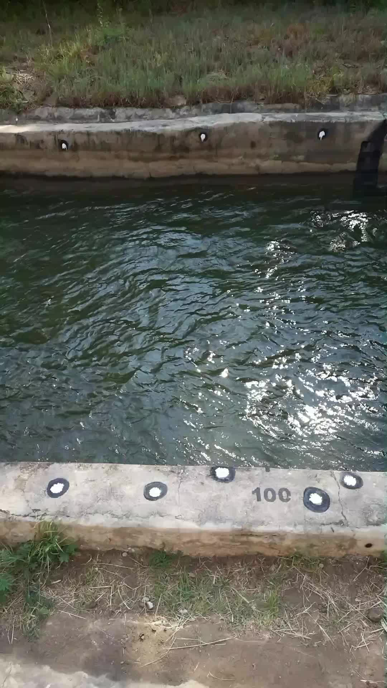

.. _field_survey:

Required field survey measurements
----------------------------------

Once a camera system is installed, several measurements are required in ORC-OS to enable processing of videos into
velocities and river flow. All of the observations needed are points in a 3D space, for which several methods
may be used.

.. important::

   It is crucial that all datasets described below are measured in exactly the same coordinate system. In some cases
   this means that you should survey everything in one survey project as your coordinate system may change if you
   start a new survey. This is particularly the case if you use a Leica disto P2P set and if you use an RTK GPS set
   with a base station with a very short survey in period. This gives good relative accuracy but not absolute. Do not
   switch off your base station during the entire survey.

.. tip::

   If you do split the survey in smaller parts, make sure you measure at least two points again in the second survey,
   so that you can correct that x, y, z offset between the different survey parts afterwards. Always check your
   observations in excel.

The required data are:

.. list-table::
      :header-rows: 1
      :widths: 25 35 35

      * - Data
        - Reason for required data
        - Tips
      * - Ground Control Points
        - Needed to make the camera understand how pixels translate into meter distances in different parts of the
          field of view. It is also crucial that the camera understands what a horizontal plane is so that it can
          project a water surface (roughly following a horizontal plane over short distances) to a real meter x meter
          image.
        - Ground control points MUST be spread in a "non-collinear" way over the objective of the camera. This means points
          should not be on a straight line. In other words, points should be spread over left and right bank and from
          upstream to downstream! If you have not performed a calibration of the camera's lens characteristics, then
          ORC-OS also uses Ground control points to constrain lens characteristics. But for this to work, the points
          should cover a significant part of the entire field of view. Check for instance the example below, where
          points were spread such that both the close and far bank have a good spread. Obviously the points close to
          the camera are much closer together in real world, but this is totally fine and a very good spread over the
          objective. Points should also not be almost at the edge of the image. Keep them a little bit away from the
          edges.
      * - Cross section profile (bottom coordinates)
        - Needed to estimate water depths with different occurring water levels, estimate the wetted cross sectional
          are and integrate velocity estimates (m/s) into river flow (m3/s).
        - Record these perpendicular to the overall flow direction in an as straight line as possible. You may have to
          wade with an instrument on a stick (e.g. RTK GPS antenna, total station or a board with marker or checkerboard
          if you use a disto). Record as much as you can, even beyond what the camera can see (see note below). Record
          more points when the bottom is very variable. If the bottom is entirely straight, only measure the points of
          inflection and measure those carefully.
      * - Water level
        - Needed to assess how the water level recorded with your survey equipment may relate to water levels recorded
          with an in-situ measurement device. Both will have a different vertical datum.
        - Measure this by holding your survey device on the line where water touches the land.
      * - Camera position
        - LOREM IPSUM
        - LOREM IPSUM

   A good spread of control points, painted on the sides of a channel