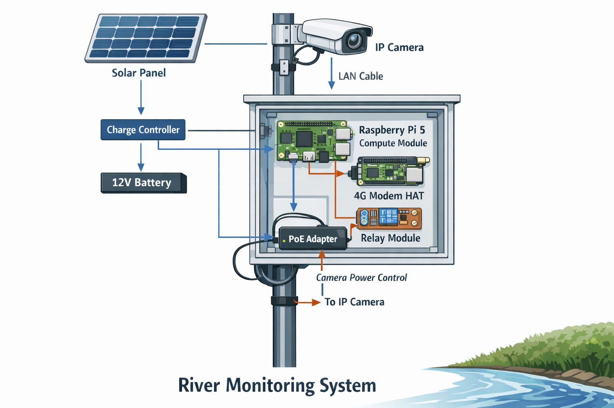

.. _prerequisites:

Hardware for using ORC-OS
-------------------------

We list here what is needed to get ORC-OS installed on a typical field device in your office.

- A small computer, such as a single board computer, running x64 or ARM64. ORC-OS is optimized for Raspberry Pi 4 or 5
  (recommended) device with 8GB of memory. We *DO NOT* support lower Raspberry Pi devices as these are not powerful
  enough and do not work with arm64 images. Please do not contact us for support on Raspberry Pi 3 or lower devices.
  See: https://www.raspberrypi.com/products/raspberry-pi-5/?variant=raspberry-pi-5-8gb

- A suitable power supply. For Raspberry Pi 4, we recommend a 5V 2A power supply. For Raspberry Pi 5, we recommend a
  5V 5A power supply. For connections in the field to a 12V battery (e.g. combined with solar panels), you will require
  a buck step down converter (check your favorite electronics store or web store). Ensure that you find one with 12V
  input (up to 24V if your battery has a higher voltage) that delivers 5V at minimum 3A (2A for Raspberry Pi 4), and
  ideally 5V 5A for a more stable and reliable power.
  supply.

- Enough storage. For Raspberry Pi, an SD card (micro) of good quality (really...try to not underspend on cheap SD
  cards) of at least 32GB in size; OR
  (better) a Raspberry Pi 5 Compute Module with a carrier board, with at least 32GB eMMC flash storage. For SD-cards,
  ensure you have a microSD card reader slot on your device, or ensure you get a SD card adapter to fit it in a large
  SD card reader.
  See: https://www.raspberrypi.com/products/compute-module-5/?variant=cm5-104032

- An IP camera, that can handle events and record at a high enough bit rate. Recommended is 20 Mbps at 1080p.
  A directly connected camera such as a Raspberry Pi (v3) camera is also possible.
  The Raspberry Pi OS will have Raspberry Pi camera libraries pre-installed. Alternatively you may use a suitable
  IP Camera that can deliver video files via FTP or SFTP.
  See: https://www.raspberrypi.com/products/camera-module-3/

- With an IP camera, a shared network switch, or modem, allowing IP camera and compute device to share the same network.

A few extra settings may have to be made on the Raspberry Pi 5 when using this setup.

- To enable low power use when switching off the Pi, follow the instructions on
  `this link <https://www.jeffgeerling.com/blog/2023/reducing-raspberry-pi-5s-power-consumption-140x/>`_
- For power cycling, you have to set up a separate service that starts the Pi at set intervals
  and shuts down the pi after a few minutes.
  This is only possible on a Raspberry Pi 5, NOT on 4. On Raspberry Pi 4 you will need a separate
  power management solution.

A typical hardware setup in the field
-------------------------------------

Once the software is installed, you will need a proper setup in the field. We try to provide
some guidance here how to establish a complete field setup here.

   :scale: 50 %
   :alt: hardware setup

   Impression of a typical hardware setup and the required connections

To help you build your own camera setup we here give an overview of possible parts that we have ourselves tested with.
The figure above gives an impression what the entire build would look like.

We use industrial grade parts and assume a setup with solar power and running every 30 minutes.
We are not frequently and actively maintaining the parts list. Please let us know if anything seems out of order by
creating a Github issue on the `ORC-OS-docs GitHub repository <https://github.com/localdevices/ORC-OS-docs>`_.

.. note::

   We do NOT give any guarantee that with these parts, your build will work. We also do not give
   any support without a project. It may be that certain parts change in time. We are never responsible for
   any issue related to your own built nor for any incompatibilities with the ORC-OS software.

  .. list-table::
      :header-rows: 1
      :widths: 35 65

      * - Part
        - Example specific item
      * - Raspberry Pi 5 CM (8/32GB)
        - `Raspberry Pi 5 <https://www.raspberrypi.com/products/raspberry-pi-5/>`_
      * - Compute Module board (8/32GB)
        - `Waveshare CM5-IO-Base-B <https://www.waveshare.com/cm5-io-base-b.htm?sku=30703>`_
      * - CM2032 rechargeable battery (for Real-Time clock and power cycling)
        - Please check availability locally. 3.7V LIR rechargeable batteries typically work.
      * - IP camera (ideally >= 20Mbps, 1080p, event-capable)
        - `AXIS P1385 <https://www.axis.com/products/axis-p1385>`_
      * - 4G modem (can also be a Raspberry Pi modem HAT like a Waveshare7600E-H)
        - `Waveshare7600E-H 4G HAT <https://www.waveshare.com/wiki/SIM7600E-H_4G_HAT?srsltid=AfmBOorAbFR9oT1jp57zfExviR1y5g-p3vRk5pf_f-1jtHWzr35EAALa>`_
      * - Relay module (ideally a Pi HAT)
        - `RPi Relay Board <https://www.waveshare.com/wiki/RPi_Relay_Board>`_
      * - PoE adapter (12V; verify power specs)
        - `LINOVISION PoE switch for DC powered systems <https://eu.linovision.com/en-eu/collections/all-poe-switches/products/4-ports-mini-solar-poe-switch-optimized-for-big-ptz-camera-and-wireless-bridges?_pos=2&_fid=d8b5ba801&_ss=c>`_
      * - 12V to 5V (USB) buck converter, 5A for Raspberry Pi 5
        - Sold on amazon.com e.g. `DEVMO 12V to 5V 5A Step-Down <https://www.amazon.com/DEVMO-Converter-Step-Down-Regulator-Transformer/dp/B09C4HPNJ8/ref=sr_1_11?dib=eyJ2IjoiMSJ9.RZsxLbFRLcU8Wb5O2N-5KjMcJ6uj1CoIoVbBQr4STi2nn6d88k_vvBEjd3TDfF1TUFG0_04Tchp9esoT8_nmfegVbZhdkErK-zT_2o9ZQX2eBJNbN-X9-kjJVchUWCA9eBo5tQZFStZovLdhs98BJyhv93V8ZhQyyslG4ILrTzFhK3OBGKHWr7ZUgFr1rJ9RxPkQkle4oxa4mNnuEAJevyGPTYtAqVepEHDPPPv1w8EHE_aqNBE0M0UVf_kjmDnycLmHf4u1SRdzXKlINuMrt2qboR1R5bS0C6TAlCN3q9o.zKXYl-61B5JUPgaXJbKZUSRhCvGflPU_vFfEAFQ1HIA&dib_tag=se&qid=1768307208&refinements=p_89%3ADEVMO&s=electronics&sr=1-11>`_
      * - Solar panel (>= 50W)
        - Any electronics/solar shop.
      * - MQTT Solar charge controller
        - Any electronics/solar shop.
      * - 12V battery (>= 96Wh)
        - Any electronics/solar shop. Consider a compact LiFePO battery for better environmental performance.
      * - CAT6 outdoor network cable of sufficient length to go from the PoE adapter to the camera
        - Any computer hardware shop.
      * - A very short (e.g. 0.5 meter) CAT6 network cable. This is for connecting the Raspberry Pi to the switch.
        - Any computer hardware shop.
      * - +/- terminal connectors compatible with the 12V battery.
        - Any electronics shop.
      * - a IP66 enclosure. Look for one that has optional cable outlets so that you can bring +/- of solar panel into
          the device and a network cable out. At least two cables will need to pass through.
          Ideally get a DIN rail in the box for proper and neat device and cable management.
        - Sold on amazon.com, but look carefully for one, large enough, and with the proper cable options.
      * - watertight cable enclosures
        - Sold on amazon.com e.g. `3.5-10mm waterproof IP68 electrical cable connectors <https://www.amazon.com/Junction-Waterproof-Electrical-Connector-3-5-10mm/dp/B083HRLQG3/ref=sr_1_8?crid=HEXI3WRNBK05&dib=eyJ2IjoiMSJ9.1OgXdhDDhFyRtnLGA9HrHG7yCSQf3A_MBkggyG9Ps9lv6DH14X6Rou6pRoXwdBd1S_5NyPLheFDoA9PCpXOyiUILaiG--e_MmnNDt_nRV508q1TGmHOfWa69i_woKkwZbBnw8zu5mEHXyfcVZDekmMhnBlnwYLVj2GDWc1F9--lTXAsviXI18nyE8OYQO4nzxGLvk1Rr7_nx5Ba2JUU1zJ0e-74Z0N8y_0vqtyURkI6J3jQq8LzkBMO5wZjLV_61di_vjqmocnXhGFOHzkUkbA2nUlQS2Bm8-Yt_owMLAcs.paFNW_AIQxvCP420cI06YyJN6FrAUH3UcIP2MYbzs54&dib_tag=se&keywords=cable%2Bconnectors%2Boutdoor&qid=1768311613&sprefix=cable%2Bconnectors%2Boutdoo%2Caps%2C190&sr=8-8&th=1>`_
      * - passthrough cable connectors for watertight connection where cables enter/exit the enclosure.
        - Sold on amazon.com e.g. `QILIPSU NPT Cable Gland Waterproof IP68 <https://www.amazon.com/QILIPSU-Waterproof-Adjustable-Locknut-Diameter/dp/B07ZRH3V59/ref=sr_1_9?crid=HEXI3WRNBK05&dib=eyJ2IjoiMSJ9.1OgXdhDDhFyRtnLGA9HrHG7yCSQf3A_MBkggyG9Ps9lv6DH14X6Rou6pRoXwdBd1S_5NyPLheFDoA9PCpXOyiUILaiG--e_MmnNDt_nRV508q1TGmHOfWa69i_woKkwZbBnw8zu5mEHXyfcVZDekmMhnBlnwYLVj2GDWc1F9--lTXAsviXI18nyE8OYQO4nzxGLvk1Rr7_nx5Ba2JUU1zJ0e-74Z0N8y_0vqtyURkI6J3jQq8LzkBMO5wZjLV_61di_vjqmocnXhGFOHzkUkbA2nUlQS2Bm8-Yt_owMLAcs.paFNW_AIQxvCP420cI06YyJN6FrAUH3UcIP2MYbzs54&dib_tag=se&keywords=cable%2Bconnectors%2Boutdoor&qid=1768311613&sprefix=cable%2Bconnectors%2Boutdoo%2Caps%2C190&sr=8-9&th=1>`_

You will need basic tools such as a wire stripper, screw drivers, crimping pliers, 12V electric wire (wire used for
speakers usually is great for 12V projects, but never use this for 220V applications!).

Assemblage
----------

Below a rough guide to assemblage is provided:

1. First install ORC-OS as indicated on the `README <https://github.com/localdevices/ORC-OS/blob/main/README.md>`_ of ORC-OS.
2. Prepare the IP66 enclosure, open up at least two of the passthrough holes.
3. Fix the modem HAT on the Pi and insert a SIM-card. MAke sure the SIM card does not have a PIN-code. This will save
   you a lot of trouble. Test the connection whilst in your office.
4. Charge your 12V battery to a satisfactory amount for testing.
5. Fix the Relay HAT on top of the modem HAT (or vice versa, whatever is easiest for you).
6. Program one of the relays on the HAT to switch on for 30 seconds during boot. This can be done using a systemd service.
   *We will provide instructions how to do this later*. This will save a lot of power as the camera is only used
   and needed very briefly.
7. Connect the PoE adapter to the 12V power supply via the programmed relays and test if the relay switches on briefly
   every time you boot up the Pi. Once tested, directly connect the PoE switch to the battery for permanent power.
8. Program the on-board RTC to switch on every 30 minutes and switch off after 5 minutes. This ensure that the entire
   setup only runs 5 minutes every half hour. This can be done using a systemd service.
9. Test this a few cycles and see if the Raspberry Pi indeed switches on/off every 30 minutes/5minutes.
   Disable the service file after testing to enable testing of other components.
   *We will provide instructions how to prepare the service file later.*

Now you have the basics running.

10. Connect the Raspberry Pi to the PoE Switch
11. Also connect the IP-camera to the PoE switch (remember to for now directly wire it, and not use the relay)
12. Connect your computer to the switch.
13. Login to the ORC-OS interface. That usually is possible on http://orcos or http://orcos.local or replace `orcos`
    for the hostname you entered whilst installing ORC-OS.
14. Go to the Settings - Daemon settings. Fill out the expected file name convention for receiving videos from your
    IP-camera (check the manual of the IP camera, you expect something like `video_20260103_141500.mp4` for a video
    taken on 3 January 2026, 2:15 PM. This would yield a naming convention `video_{%Y%m%d_%H%M%S}.mp4`. Click on `Submit`.
15. Now click on <EXAMPLES> to see how to get such video files transferred from the IP camera to the raspberry pi.
    You want to note the SFTP details and the specific folder the files should go to.
16. Now login to the IP camera web interface (check the IP camera's manual).
17. Program an "event" that records a 5-sec video when the camera switches on. Use SFTP to transfer the video file
    directly to the Raspberry Pi using the details taken from ORC-OS.
    Ensure the bit rate is high! Ideally 20Mbps (Megabit per second). This is to ensure
    that the details visible on the water surface are not lost through compression.
18. Test the event and check if the files indeed end up in the right folder. Currently these are not yet processed.
19. Install all components in the IP66 enclosure. Wire up the solar panels (first connect the battery to the charge
    controller, then the panel). Pass the cables and fix these watertight with passthrough cable connectors.
20. Make sure that the PoE adapter is rewired through the relay module so that it only switches on briefly.
21. Go into the field and start configuring ORC-OS! See our extensive :ref:`User guide <user-guide>`
22. Once configured, enable all the systemd service files (relay and power cycling).
23. Wait for a few cycles to see if everything works as expected.
24. Go home and let the device collect your data.

.. note::

   If you decide to get a service contract for support from Rainbow Sensing, you will receive remote connectivity for
   your devices within the support package if your device is compatible. Remote support works through a pangolin server
   and accounts and offers you a https access to services via a proxy server, with highly granular access. This is very
   similar to services such as remoteit and cloudflare, but own-hosted. Contact us at info@rainbowsensing.com for
   further information.
