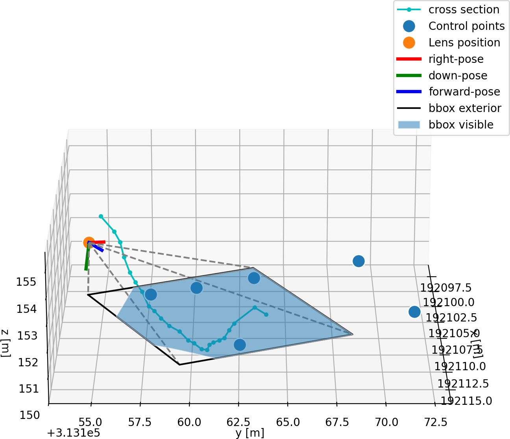

.. _video_conf_intro:

What is a video configuration?
------------------------------

.. note:: 

   For automated processing of videos, a video configuration is needed. A video configuration holds all the information
   to process a raw video into meter-per-second velocities and cubic-meter-per-second discharge with user-defined 
   options. Once defined for a fixed camera setup, the same configuration can be used for all other videos taken with 
   the same camera setup, as long as the camera has not moved. We advise you to set up a video configuration as soon 
   as you have taken your first video and have performed the survey of GCPs and cross-sections. This is to ensure you
   leave the field knowing your measurements are correct and that you have all the information needed to process your 
   videos. After downloading and preprocessing your survey points, expect to spend about 10 minutes on this process.
   
The required information includes:

* The position and orientation of the camera with respect to the water surface, and in particular also the cross
  section. This also called the camera "pose". It consists of an x, y, z coordinate of the camera in a local coordinate
  system, and the three angles over which the camera can be rotated, also known as yaw, pitch and roll. This is
  a rather technical description of how the camera is rotated with respect to the direction of the real-world
  coordinate axes. For instance if you use a geographical coordinate system:
  - positive x-direction is east-west
  - positive y-direction is south-north
  - positive z-direction is upwards perpendicular to a flat surface towards the sky.

  In OpenRiverCam, the camera's intrinsic x-axis points from the centre to the right of the lens, the y-axis points 
  from the centre downwards, and z-axis is from the lens forwards following the OpenCV standards. This camera model is 
  depicted in the image below.

  .. figure:: https://docs.opencv.org/4.x/pinhole_camera_model.png

     Pinhole camera model with x, y and z directions. Source:
     `OpenCV documentation. <https://docs.opencv.org/4.x/d9/d0c/group__calib3d.html>`_

  The camera pose is estimated using so-called "ground control points": a number of known 3D coordinates
  (e.g. point P in the figure above) are
  matched against the pixel locations (u, v in the figure above) which provides a constraint for this pose. Lens
  parameters that distort straight lines (see red line) within the lens are also estimated in this process.

* The area of interest a.k.a. "bounding box": this should be a rectangular area on the water surface around the
  measured cross-section in which you want velocities to be
  estimated. We advice such an area to extend at least 2 meters upstream and downstream of the cross section and span
  the entire cross-section that contributes to flow under high flow conditions.
  
  .. note::

    while you are selecting an area of interest, consider that during your survey, the water level may be low and
    the area of interest relatively small. During high flows, the water surface becomes wider, and therefore the 
    area of interest will grow. It is therefore very important to consider which parts of the cross section may 
    become inundated during high flows, and choose an area of interest that is large enough to also cover parts that
    are not inundated during your survey, but could become inundated during high flows.

  Areas that become inundated but not seriously contribute to flow, or that are not visible from the camera can be left
  out. These will only increase processing time without providing much useful information.

* Cross-sections: these must be measured in the **exact same coordinate reference system** (also vertically!) as the 
  camera pose! Two cross sections can be supplied: one that should follow the river bed and is used to estimate the 
  wetted perimeter and surface area and combined, the river discharge. Another cross-section can be supplied that may 
  be used for optical detection of water levels. This cross-section does not have to exactly follow the entire river 
  bed. Instead it may follow vertical structures that can be used to identify a water line, such as a bridge pier, a 
  set of staff gauges (in which case the coordinates should jump from one x, y, location to the next where you must 
  move to the next staff gauge).

* Processing settings: these include settings defining the used frames, frame resolution, spatial resolution in which
  data must be projected, settings for optical water level detection, settings for extracting velocity estimates over
  the cross-section and plot settings.

Once all of these are completed for one single sample video with control points in view, the same video configuration
can be used for all other videos taken with the same camera set up, as long as the camera has not moved.
The figure below depicts what geographical information is available after performing the video configuration.
It shows:

* the 3-D control points (blue dots)
* the derived camera location (orange dot) and orientation (red, green and blue lines)
* the cross section (cyan dotted line)
* and, for one specific water level, the bounding box (black) and the part of the bounding box visible in the camera
  objective (blue shade). Note that when the water level goes up and down, obviously the location of the water surface
  in the camera's objective changes and therefore, the bounding box goes up and down as well. OpenRiverCam
  automatically reprojects this with each video, using the current water level for that video.

In the remaining sections, we explain the different parts and steps to video configuration in more detail.
